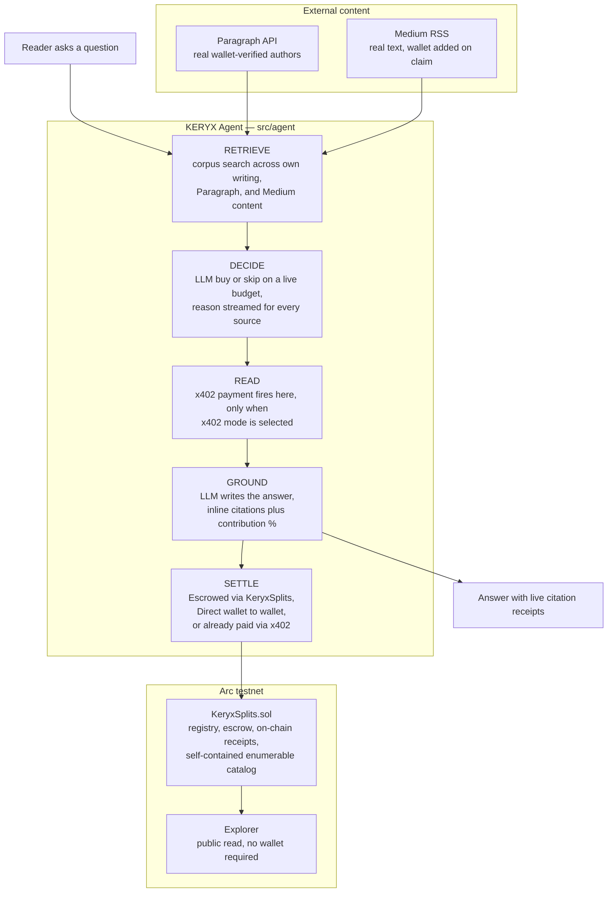

# KERYX
### An answer engine that pays its sources — every citation settled on-chain, in USDC, on Arc.


> **Ask a question. The agent decides which sources are worth reading, grounds its answer in them, and strikes a sub-cent USDC payment to every writer it draws from — the instant the citation happens.**

The fastest-growing reader of the open web is no longer a person. It is an AI agent, and it treats every article, thread, and post as free substrate. The writer who did the work gets nothing back. KERYX closes that loop: it answers like any AI, but it **pays the writers it was built from**, per citation, on-chain, checkable by anyone with no wallet and no trust required.

This is the thing the incumbents gesture at but have not shipped. TollBit and Cloudflare charge per *crawl*, paid even when the work is never actually used. ProRata pays per *citation* but settles **monthly**, off proprietary math a writer cannot independently verify. KERYX settles **per citation, instantly, transparently, at a sub-cent floor**, which only clears because Arc has native USDC gas and sub-second finality. Sam Altman called agent-paid micropayments the future of publishing. This is the on-chain version of that idea, and it already runs.

---

## Live Resources

| Resource | Link |
|---|---|
| **GitHub** | https://github.com/0xkinno/keryx |
| **Live Demo** | https://keryx-six.vercel.app/ |
| **Video Demo** | https://youtu.be/BTff_XWbgDg?si=Ultb5YDr6QASssj0 |
| **Frontend** | React app in `web/`, run locally with `npm run dev` |
| **Agent API** | `http://localhost:4000`, run locally with `node src/server.js` |
| **Deployed contract** | `KeryxSplits.sol` on Arc testnet, source verified via Sourcify |
| **Independent proof** | `node scripts/proof.js` — prints every real settlement straight from the chain |
| **Independent catalog check** | `node scripts/diagnose.js` — prints the contract's own registered works, no caching |
| **Network** | Arc testnet, USDC settlement |

---

## The Problem

Three things are broken in how value moves between writers and the machines that read them.

**1. AI reads everyone, pays no one.** Agents and answer engines ground their output in human-written work and return zero value to the source. A single citation is worth a fraction of a cent, and on most chains the gas fee alone would exceed the payment, so settlement never happened.

**2. The "fixes" do not actually pay per use.** Pay-per-crawl charges for a fetch, not a use. Pay-per-citation incumbents batch into a monthly figure computed by a black box the writer cannot check line by line. Neither is instant, neither is independently verifiable.

**3. There was no rail for the real unit.** A citation can be worth well under a cent. Arc changes that arithmetic: USDC is the gas token itself, so a sub-cent settlement is a real, final transaction, not a rounding error eaten by fees.

KERYX removes all three at once.

---

## The Solution

```
┌────────────────────────────────────────────────────────────────────────────────┐
│                                 KERYX PIPELINE                                  │
├──────────┬───────────┬───────────┬───────────┬────────────┬────────────────────┤
│ REGISTER │ RETRIEVE  │  DECIDE   │   READ    │  GROUND    │  SETTLE            │
├──────────┼───────────┼───────────┼───────────┼────────────┼────────────────────┤
│ Writer   │ Question  │ Agent     │ x402 pays │ Write the  │ Strike a payment  │
│ sets a   │ pulls     │ weighs    │ to unlock │ answer,    │ to each cited     │
│ title,   │ candidate │ cost vs   │ a bought  │ cite each  │ writer per their  │
│ price,   │ sources   │ value on  │ source,   │ source     │ split — escrowed, │
│ wallet   │ from the  │ a shrink- │ only when │ inline,    │ direct, or via    │
│ split,   │ live      │ ing       │ x402 mode │ weight its │ x402 at read      │
│ on chain │ corpus    │ budget    │ is chosen │ share      │ time               │
└──────────┴───────────┴───────────┴───────────┴────────────┴────────────────────┘
        WALLETS          ·          x402          ·       KeryxSplits.sol
```

The design decision that matters: **the agent makes a real economic choice on every query.** It does not fetch everything. It judges each candidate on value against price, buys only what will shape the answer, explains out loud whenever it passes on a more relevant but pricier source in favor of a cheaper one, and pays only for what genuinely earns a place in the final answer.

---

## Architecture



---

## The Settlement Flow

KERYX ships three independent settlement rails, chosen fresh by the reader on every question, never fixed to the work itself.

```
 ESCROWED
 reader wallet                 KeryxSplits.sol                 writer balance
      │                              │                                │
      │  approve(USDC, budget)       │                                │
      │─────────────────────────────►│                                │
      │  agent calls                 │   transferFrom(reader → each   │
      │  settleAnswer([w1,w2,...])   │      recipient's balance)      │
      │──────────────────────────────►───────────────────────────────►│
      │                              │   emit CitationSettled(...)    │
      ▼                              ▼   funds held until withdraw()  ▼

 DIRECT
 reader wallet ─────────────────────────────────────────────► writer wallet
      one signed transfer per recipient, split correctly, arrives instantly

 x402
 agent wallet ── GET /content/:workId ──► 402 Payment Required
      │                                          │
      │◄───────────── signs payment, retries ────┘
      ▼
 Circle Gateway settles on Arc, real author paid the moment the source is read
```

Escrowed and Direct pay only what is actually cited, after the answer is written. x402 pays the moment a source is opened, whether or not it ends up quoted, a genuinely different and defensible model, closer to paying for access than paying for use.

---

## Circle and Arc — exact usage

| Pillar | Where | What it does in KERYX |
|---|---|---|
| **Arc testnet** | throughout | Native USDC gas is the entire reason sub-cent settlement is real rather than theoretical. |
| **Circle Gateway, x402** | `src/circle/x402.js`, package `@circle-fin/x402-batching` | The real toll. A genuine HTTP 402 challenge gates `/content/:workId`; the agent's `GatewayClient` signs and settles automatically, confirmed by hand with a raw `curl -i` request. |
| **Wallets** | `web/src/wallet.js` | Reown AppKit and wagmi on Arc, one connect flow for every reader and writer, MetaMask, Rabby, WalletConnect, and any injected wallet. |
| **Contracts** | `contracts/KeryxSplits.sol` | Registration, co-author splits, escrow, and a permanent on-chain citation receipt. |
| **USDC** | everywhere | The unit of settlement and the gas token on Arc, six decimal precision matched exactly between contract and frontend. |

---

## `KeryxSplits.sol` — contract reference

Fully self-contained on chain. Title, source URL, price, and every recipient split live directly in contract storage, so the entire catalog can be discovered by any wallet with no off-chain index required.

| Function | Who calls it | Effect |
|---|---|---|
| `registerWork(workId, title, url, recipients[], bps[], price)` | any wallet, must be one of the listed recipients | Registers a payable work with co-author splits built in from the start; `bps` must sum to `10000`. |
| `updatePrice(workId, newPrice)` | the work's primary recipient | Reprices a work after registration. |
| `settleCitation(workId, reader, amount)` | agent only | Settles one citation, split across recipients by basis points. |
| `settleAnswer(workIds[], reader, amounts[])` | agent only | Settles every citation for one answer in a single transaction. |
| `withdraw()` | any writer | Withdraws that caller's full accumulated balance. |
| `citationsOf(workId)` | anyone, free | Real, on-chain citation count. |
| `workCount()` / `getWorkIdsPage(offset, limit)` | anyone, free | Enumerate the entire catalog straight from the chain. |
| `getWork(workId)` | anyone, free | Full details for one work, no off-chain lookup needed. |

| Event | Emitted when | Carries |
|---|---|---|
| `WorkRegistered` | a work is registered | `workId`, title, url, recipients, bps, price |
| `PriceUpdated` | a price changes | `workId`, old price, new price |
| `RecipientCredited` | a citation splits payment | `workId`, recipient, amount |
| `CitationSettled` | a citation is paid | `workId`, reader, amount, timestamp |
| `AnswerSettled` | one answer finishes settling | reader, citation count, total amount |
| `Withdrawn` | a writer withdraws | writer, amount |

No pooled custody: the contract credits each recipient's own balance directly. Every payout is a verifiable, permanent event.

---

## The Agent Loop

The agent's judgment is two LLM calls, isolated in `src/agent/llm.js`.

1. **`decideSources`** — given candidates and a live budget, returns `BUY` or `SKIP` per source with a relevance score and a plain-language reason. This is the agency: it spends only where the value justifies the cost, and explains itself when it passes on a more relevant but pricier source.
2. **`groundAnswer`** — writes the answer strictly from the sources actually bought, cites each one inline, and assigns a contribution percentage per citation.

`src/agent/loop.js` orchestrates retrieve, decide, read, ground, settle, streaming a live event feed (`retrieved · decision · purchased · answer · settled · complete`) that the frontend renders as it happens. The remaining budget recalculates and streams after every single decision, so a viewer watches it count down in real time.

---

## Incorporating Articles, Paragraph, Medium, and Beyond

KERYX pulls real, external content two ways, both run from the terminal.

```bash
node scripts/ingest-paragraph.js "DeFi trust"    # real, wallet-verified Web3 articles
node scripts/ingest-medium.js someusername        # real article text from a public Medium profile
```

Paragraph content arrives with a real author wallet already attached, pulled straight from their public API, so it is citable and immediately payable the moment it is indexed. Medium content arrives as real article text with no wallet attached, since Medium has no wallet concept at all, so it is citable and genuinely usable by the agent, but not payable until that real author connects the matching wallet and registers themselves through the app. Nothing here claims authorship on anyone's behalf that has not been earned by their own signature.

Both scripts can be scheduled as Render Cron Jobs so the corpus quietly refreshes on its own, independent of anyone actually using the app.

---

## Wallet Connect

`web/src/wallet.js` wires Reown AppKit and wagmi on Arc testnet, giving a single connect flow that opens MetaMask, WalletConnect, Coinbase Wallet, Rabby, and any injected wallet. Writers connect to register and withdraw. Readers connect to ask, approve, and pay. The agent runs from its own server-side key, entirely separate from any user's wallet.

---

## API Reference

| Method | Route | Purpose |
|---|---|---|
| `GET` | `/content/:workId` | Publisher-side source content, gated by a real x402 challenge. |
| `POST` | `/api/ask` | Runs the agent loop, streams progress over server-sent events. |
| `GET` | `/api/works` | The local content index used for retrieval. |
| `POST` | `/api/register-work` | Persists a work's content for citation, separate from on-chain registration. |
| `GET` | `/api/health` | Status and current configuration. |

`POST /api/ask` body: `{ "question": "Why does privacy matter in DeFi?", "reader": "0x...", "settleMode": "escrow" }`, where `settleMode` is `"escrow"`, `"x402"`, or `"direct"`.

---

## Run Order

```bash
# 0. install and configure
npm install
cp .env.example .env

# 1. deploy the contract, straight from the terminal, no Remix required
node scripts/deploy.js              # prints the new contract address, set KERYX_CONTRACT_ADDRESS

# 2. register the seed corpus on the new contract
node scripts/register-seed.js

# 3. fund the agent's Circle Gateway balance, one time, for x402
node scripts/fund-gateway.js

# 4. run the agent API
node src/server.js                  # http://localhost:4000

# 5. run the frontend, from web/
cd web && npm install && npm run dev   # http://localhost:5173

# 6. verify independently, any time
node scripts/proof.js               # every real settlement, read straight from the chain
node scripts/diagnose.js            # the contract's own catalog, ground truth
```

Open the app, connect a wallet, ask a question, and watch a real citation settle, live, in one pass.

---

## Environment

| Group | Keys | Notes |
|---|---|---|
| **Arc** | `ARC_RPC_URL`, `ARC_CHAIN_ID` | `https://rpc.testnet.arc.network`, chain id `5042002`. |
| **USDC** | `USDC_ADDRESS` | Native USDC on Arc testnet. |
| **Agent wallet** | `AGENT_PRIVATE_KEY` | Pays x402 tolls, calls escrow settlement, must be an EOA wallet. |
| **Contract** | `KERYX_CONTRACT_ADDRESS` | Set after running `scripts/deploy.js`. |
| **x402** | `PUBLISHER_ADDRESS`, `PUBLISHER_BASE_URL`, `X402_NETWORK`, `X402_FACILITATOR_URL` | Network is `eip155:5042002`; facilitator is `https://gateway-api-testnet.circle.com`, both confirmed directly from Circle's own documentation. |
| **Agent** | `ANSWER_BUDGET_USDC`, `RETRIEVE_K`, `LLM_BASE_URL`, `LLM_API_KEY`, `LLM_MODEL` | Budget, retrieval depth, and the LLM used for judgment. |
| **Settlement** | `SETTLE_MODE` | Default mode, overridable per request: `escrow`, `x402`, or `direct`. |

---

## Project Structure

```
keryx/
├── contracts/
│   └── KeryxSplits.sol           registry, escrow, splits, on-chain catalog
├── scripts/
│   ├── deploy.js                   compiles and deploys straight from the terminal
│   ├── register-seed.js            registers the seed corpus on a fresh deployment
│   ├── fund-gateway.js             one-time Circle Gateway deposit for x402
│   ├── proof.js                    independent, read-only settlement verification
│   ├── diagnose.js                 independent, read-only catalog verification
│   ├── ingest-paragraph.js         real wallet-verified content from Paragraph
│   └── ingest-medium.js            real article text from public Medium feeds
├── src/
│   ├── chain/arc.js                 Arc testnet client, agent wallet
│   ├── circle/x402.js               real x402 challenge and Gateway settlement
│   ├── settle/citation.js           calls settleAnswer, formats amounts safely
│   ├── corpus/store.js              persistent content index and retriever
│   ├── agent/
│   │   ├── llm.js                    decideSources and groundAnswer
│   │   └── loop.js                   retrieve, decide, read, ground, settle
│   └── server.js                    REST and SSE API
├── web/src/
│   ├── App.jsx                      full React interface
│   ├── wallet.js                    Reown AppKit and wagmi on Arc
│   └── keryx.css                    design system
├── data/
│   └── corpus.json                  local content index for retrieval
└── .env.example
```

---

## Why KERYX Excels

| Criterion | Weight | How KERYX earns it |
|---|---|---|
| **Agentic Sophistication** | 30% | A real, streamed, budget-constrained decision on every question, with the agent explicitly explaining when it chose a cheaper source over a more relevant but pricier one. |
| **Traction** | 30% | A public catalog and settlement ledger readable straight from the chain by anyone, real external content from a live platform with real wallets, and two independent scripts that verify everything without touching the app's own UI. |
| **Circle and Arc Tool Usage** | 20% | Native USDC gas makes sub-cent settlement real rather than theoretical, and x402 is genuinely wired through Circle's own Gateway package, confirmed by hand, not simulated. |
| **Innovation** | 20% | Three settlement rails with a real, stated tradeoff between them, on-chain co-author splits, and a catalog that needs no off-chain index to be discovered. |

---

## Tech Stack

| Layer | Technology |
|---|---|
| Settlement | Arc testnet, USDC, `KeryxSplits.sol`, Solidity ^0.8.20 |
| Nanopayments | Circle Gateway, x402, `@circle-fin/x402-batching` |
| Chain client | viem |
| Agent | Node.js, Express, server-sent events, OpenAI-compatible LLM |
| Wallets | Reown AppKit, wagmi, WalletConnect |
| Frontend | React, single-page application |
| License | Apache 2.0 |

---

*Built for the Lepton Agents Hackathon, Canteen × Circle × Arc, 2026.*

**The smallest unit of value finally moves. A writer is paid the moment the machine reads them, and anyone, including a judge with no wallet connected, can check that it happened.**
